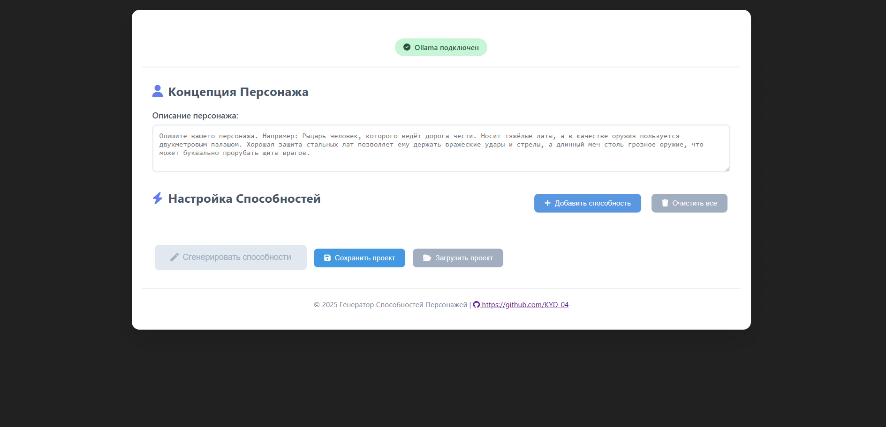

# AbilityForge

### Генератор способностей и навыков на базе ИИ для писателей

AbilityForge - это веб-инструмент, использующий локальную LLM (Ollama) для генерации уникальных, контекстных описаний игровых способностей, навыков, заклинаний и талантов. Определяйте пользовательские параметры, добавляйте ключевые слова для контекста и визуализируйте каждую способность с помощью интерактивных радарных диаграмм (роза ветров).


---

### Возможности

- **Пользовательские параметры** - Определяйте любые параметры для способностей (урон, перезарядка, стоимость маны, дальность и т.д.)
- **Контекст ключевых слов** - Добавляйте ключевые слова через точку с запятой для направления генерации ИИ (например, "магия огня; взрывной; по площади")
- **Описания от ИИ** - Работает на локальной Ollama LLM для приватности, скорости и доступности
- **Визуализация радарной диаграммой** - Каждая способность отображает радарную диаграмму нормализованных параметров
- **Управление проектами** - Сохраняйте и загружайте конфигурации способностей в JSON-файлах
- **Пакетная генерация** - Генерируйте описания для нескольких способностей сразу
- **Полностью оффлайн** - Работает полностью на вашей локальной машине, без облачных API

---

### Скриншоты



---

### Требования

- Python 3.8+
- [Ollama](https://ollama.ai/) установлен и запущен локально
- Загруженная LLM модель (например, `llama3`, `mistral`, `gemma2`) (см. подробности https://github.com/ollama/ollama)

---

### Установка

#### 1. Клонируйте репозиторий

```bash
git clone https://github.com/KYD-04/AbilityForge.git
cd AbilityForge
```

#### 3. Установите и настройте Ollama

Смотри подробности https://docs.ollama.com/quickstart

Требование для проекта: Ollama должен быть доступен по адресу http://localhost:57002

#### 4. Запустите приложение

```bash
python run.py
```

Откройте браузер и перейдите по адресу `http://localhost:5000`

---

### Использование

#### Создание способностей

1. Нажмите **"Добавить способность"** для создания новой способности
2. Добавьте параметры с их значениями:
   - `Урон: 150`
   - `Стоимость маны: 45`
   - `Перезарядка: 3`
3. Добавьте ключевые слова через точку с запятой:
   - `Магия огня; снаряд; взрывной; по одной цели`
4. Сохраните способность

#### Генерация описаний

1. Настройте все ваши способности
2. Нажмите **"Сгенерировать"** для создания описаний ИИ
3. Просмотрите сгенерированный текст и радарную диаграмму для каждой способности

#### Управление проектами

- **Сохранить проект**: Экспортируйте конфигурацию в JSON-файл (включая ключевые слова!)
- **Загрузить проект**: Импортируйте ранее сохранённую конфигурацию

---

### Настройка

#### Изменение модели LLM

Измените название модели в файле `models/llm_client.py`:

```python
self.model = "llama3"  # Измените на предпочитаемую модель
```

#### Поддерживаемые модели

Работает любая Ollama-совместимая модель:

| Модель | Описание |
|--------|----------|
| `llama3` | Meta Llama 3 - сбалансированная производительность |
| `mistral` | Mistral 7B - быстрая и эффективная |
| `gemma2` | Google Gemma 2 - хороша для креативного текста |
| `qwen2` | Alibaba Qwen 2 - мультиязычная поддержка |

---

### Примеры использования

- **Разработка игр** - Генерация описаний способностей для RPG, MOBA, карточных игр
- **Настольные RPG** - Создание описаний заклинаний и навыков для D&D, Pathfinder и др.
- **Креативное письмо** - Разработка магических систем и способностей персонажей для художественной литературы
- **Геймдизайн-документация** - Быстрое прототипирование концепций способностей

---

### Лицензия

Этот проект лицензирован под MIT License - см. файл [LICENSE](LICENSE) для подробностей.

---

<p align="center">
  <b>Куй свои способности. Раскрой креативность.</b><br>
  <i>Forge your abilities. Unleash creativity.</i>
</p>
